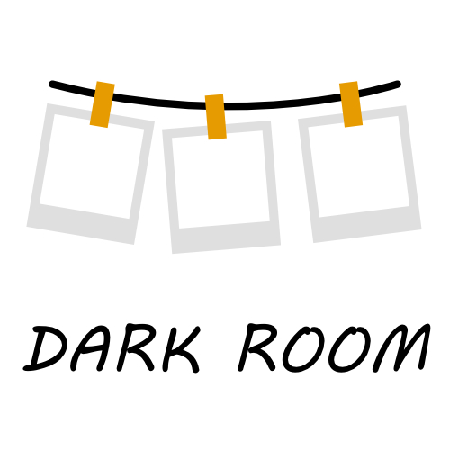

# Darkroom 🖼️

A single-file, browser-based photo triage and editing tool. Point it at a folder of images and quickly crop, retouch, frame, and discard your way through them — then export everything as one `.zip`. No install, no server, no account, no upload: everything runs locally in the browser.

## Features

- **Local-first, zero setup** — a single self-contained `.html` file. Double-click it and it runs, fully offline, in Chrome, Edge, or Firefox.
- **Folder import** — pick a folder of images and review them one by one in a grid.
- **Crop**
  - Quick aspect-ratio presets (1:1, 4:3, 3:2, 16:9, Free) — click a ratio for an instantly centered crop.
  - Click the same ratio again to flip it between portrait and landscape.
  - Drag to draw a custom crop box, drag inside it to move it, or grab any of the 8 corner/edge handles to resize it.
  - Optional rule-of-thirds guides overlay, toggled on/off.
- **Rotate** — a free-angle slider (-180° to 180°) plus one-tap ±90° buttons.
- **Retouch** — 8 live-preview adjustments: Brightness, Contrast, Saturation, Exposure, Temperature, Shadows, Highlights, and Sharpness.
- **Frames** — 12 proportionally-sized frame styles (Polaroid, Instant, Film border, White border, Vintage, Retro, Photo booth, 35mm, Negative, Contact sheet, Scrapbook, Postcard), each shown as a live thumbnail preview of *your* photo before you pick it. Margins scale with the photo's own dimensions, never fixed pixels.
- **Fast input controls** — scroll the mouse wheel over the photo to zoom the preview (view only, doesn't affect the crop), or over any slider to nudge its value. Arrow keys jump to the next/previous photo without leaving the editor.
- **Smart workflow** — saving a photo automatically advances to the next unedited one, skipping photos you've already saved. Discard photos you don't want with one click.
- **Export to ZIP** — nothing is written to disk until you choose to. Every save/frame is collected in memory; the "Download ZIP" button bundles everything into one `.zip` that lands in your normal Downloads folder.
- **Settings**
  - Language: English / Español, switchable at any time.
  - Theme: Dark / Light.

## Getting started

1. Download `galeria-editor.html` from this repo.
2. Open it in a Chromium-based browser (Chrome, Edge) or Firefox — just double-click the file, no server required.
3. Click **Choose folder**, select a folder of images, and start editing.
4. When you're done, click **Download ZIP** to save your edited photos.

You can also open it directly from your file system, host it on any static file host, or add it to your home screen as a lightweight local app.

## How it works

Darkroom is intentionally dependency-light:

- Image decoding/editing is done with the Canvas 2D API (`createImageBitmap`, `getImageData`/`putImageData` for pixel-level adjustments like exposure, shadows/highlights, and the sharpen convolution).
- Rotation and cropping are composited into a working bitmap so edits stay consistent regardless of order.
- Frames are drawn procedurally per-photo (no image assets), with all margins computed as a percentage of the photo's shorter side.
- [JSZip](https://stuk.github.io/jszip/) (loaded from a CDN) bundles the finished images into a downloadable archive.
- No backend, no analytics, no external image upload — everything happens in the tab.

## Browser support

Requires a modern browser with Canvas 2D, `createImageBitmap`, and the folder-picker (`webkitdirectory`) input. Chrome and Edge are fully supported; Firefox works for import and editing. Safari support may vary.

## License

Add your preferred license here (e.g. MIT).
